# product-store

## Overview

This full-stack web application allows users to perform full CRUD operations (Create, Read, Update, Delete) for managing product data. The front-end is built with **React.js**, while the back-end uses **Express** and **Node.js** to create a RESTful API, with **MongoDB** for data storage. Built a fully-responsive UI that leverages React hooks and state management for dynamic UI updates. I deployed the app using Render.

## Features

- **Full CRUD Functionality**: Users can create, read, update, and delete products.
- **Responsive UI**: Built with React.js and styled with Chakra UI, ensuring a seamless experience across devices.
- **State Management**: Utilized React hooks to manage product states and dynamic UI updates.
- **RESTful API**: Built with Express.js and Node.js for handling product operations and managing routing.
- **Error Handling**: Comprehensive error handling for API requests, ensuring robust functionality.
- **MongoDB Integration**: Efficient data persistence using MongoDB, optimized with schema design and indexing.

## Prerequisites

- Node.js and npm installed on your system.
- Familiarity with Express.js and building APIs.
- I used VS Code for development, and Postman for backend API testing. You can choose any IDE of your own.

## Setup Instructions  

Follow these steps to set up and run the application locally:

1. Clone the repository:

    ```bash
    git clone https://github.com/saurxbh/product-store.git

2. Set up .env file

    ```bash
   MONGO_URI: your-mongodb-database-connection-string
    PORT: 8080

3. Build the project

   ```bash
   npm run build

4. Start the app

   ```bash
   npm run start

## Execution

- Homepage is displayed and all the products in the database are fetched when '/' endpoint is hit. You can also toggle themes.

  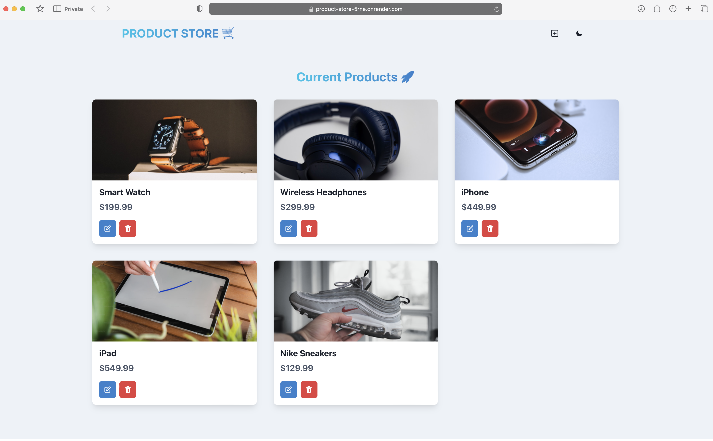
  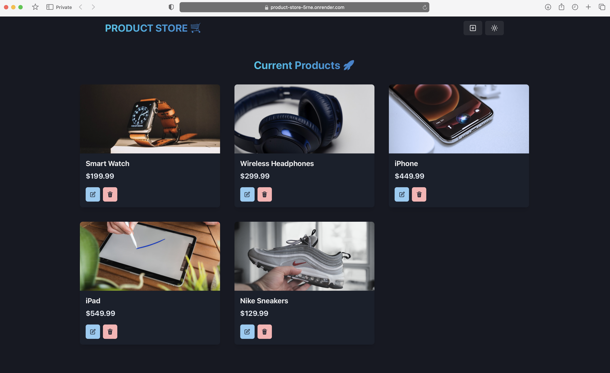

- The small '+' sign in the top right corner on the navbar provides the functionality to create a product. Upon clicking this button, '/create' endpoint is hit, where you can enter the product details to be created. After successfully creating a product, a toast is displayed and UI is updated to display the newly created product. 

  
  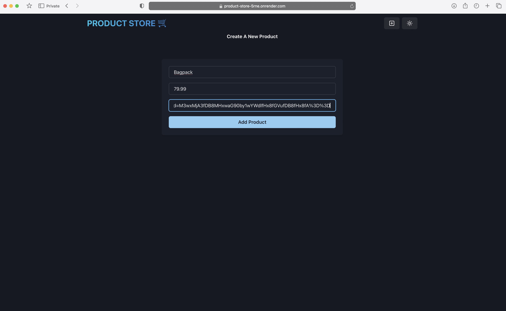
  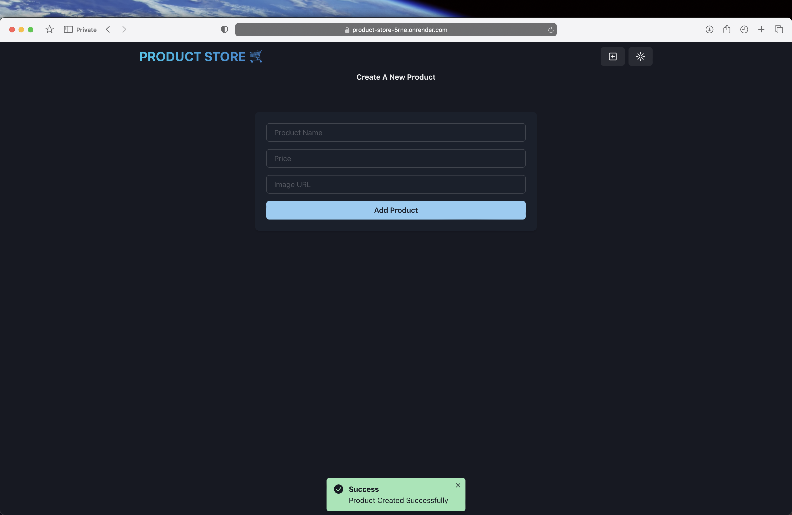
  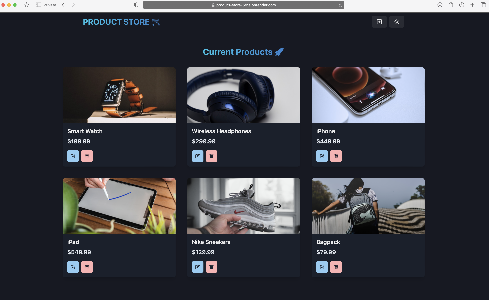

- A product can be edited by clicking the edit button on the product card, after which a modal is displayed. It is a React component from ChakraUI library. After entering updated details and clicking updated, a toast is displayed and UI is updated.

  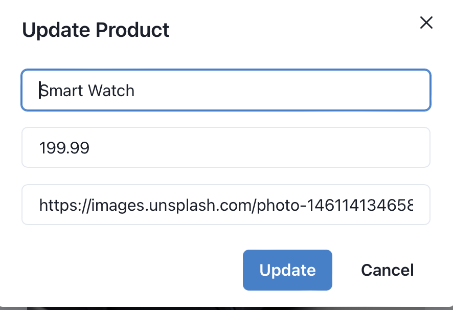
  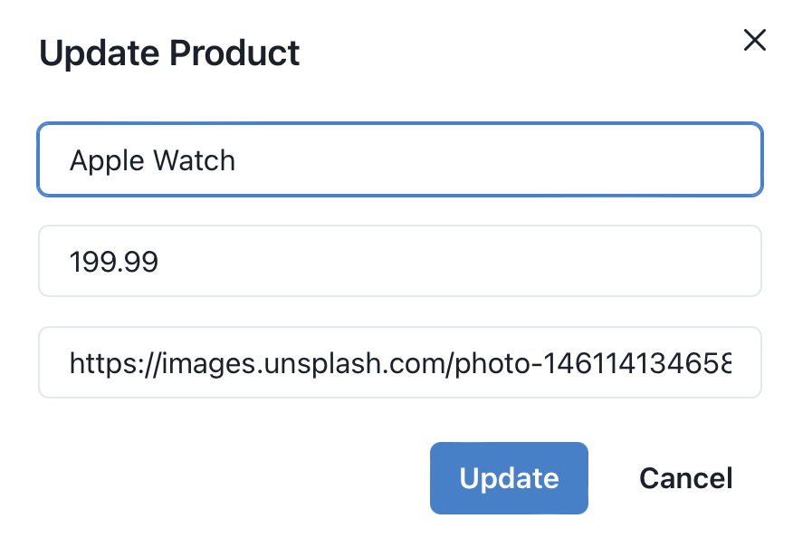
  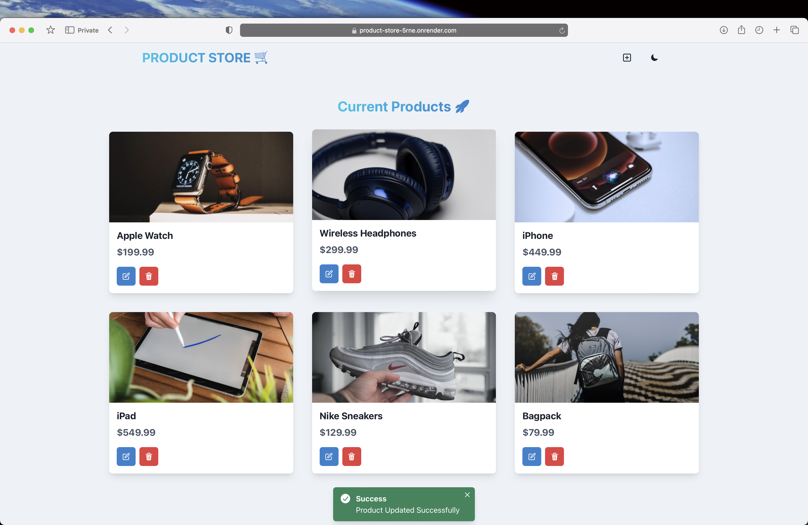

- Delete button on a product card can be used to delete the product.

  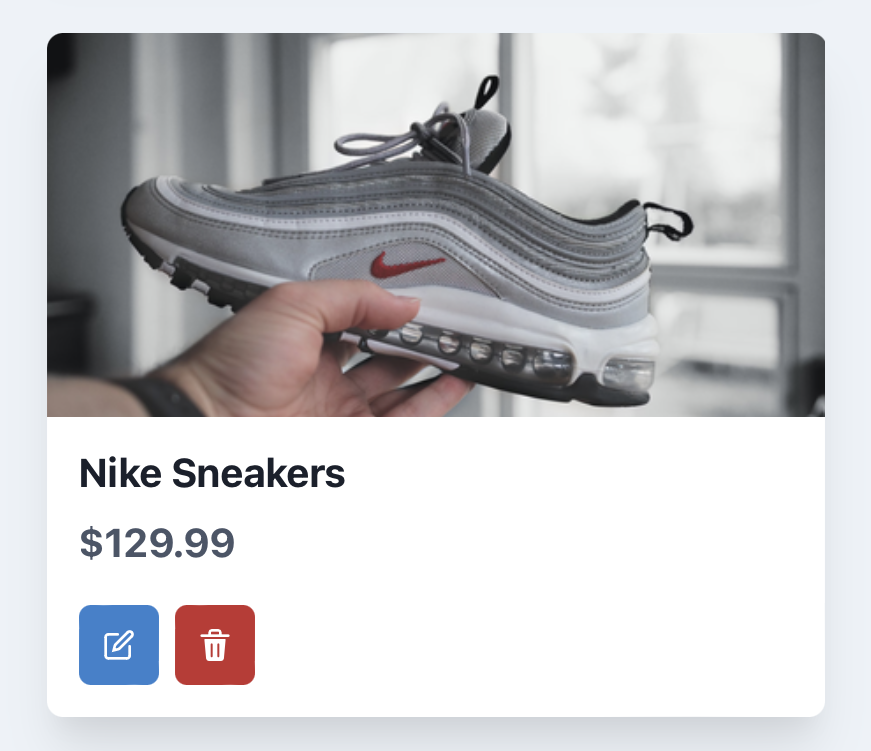
  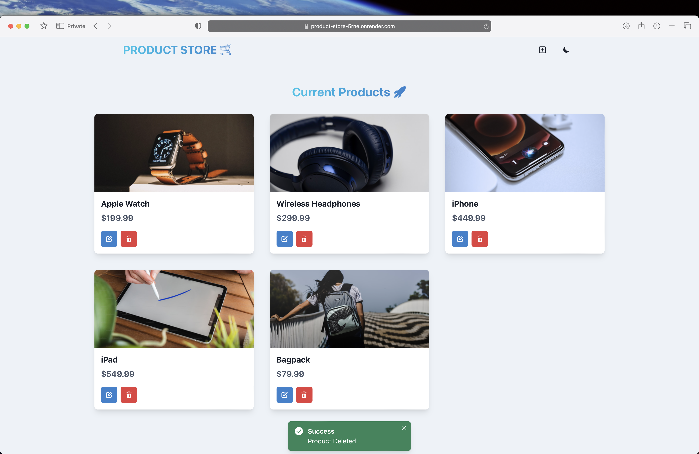

- Responsive design is implemented
  
  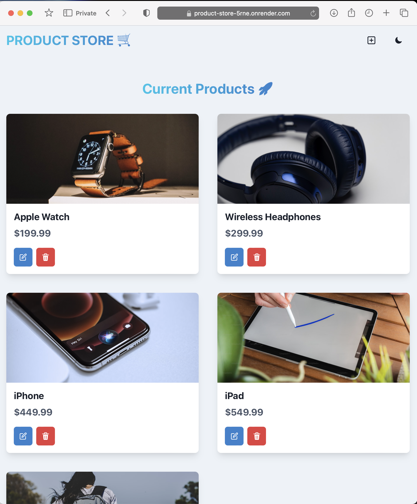
  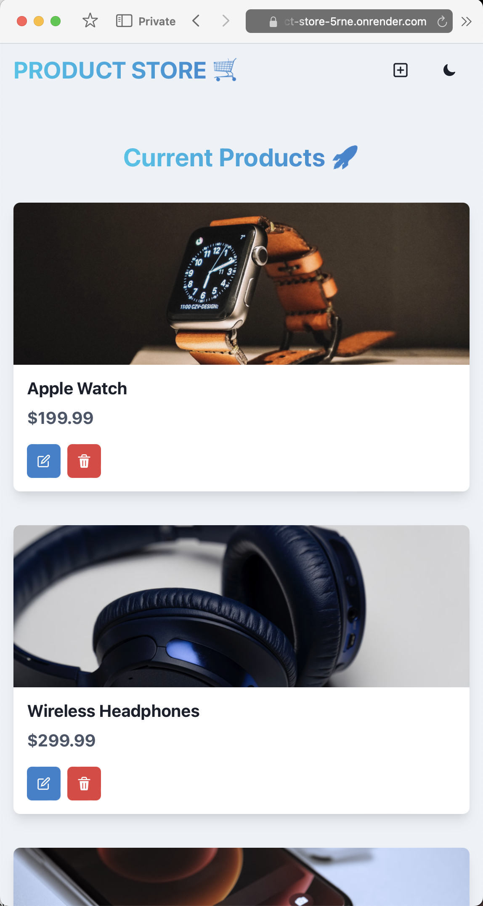

- When there are no products in the database, following screen is displayed prompting the user to create a product.
  
  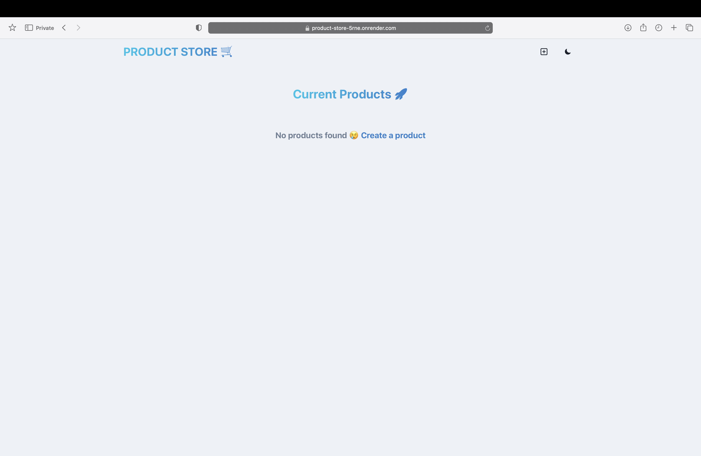

